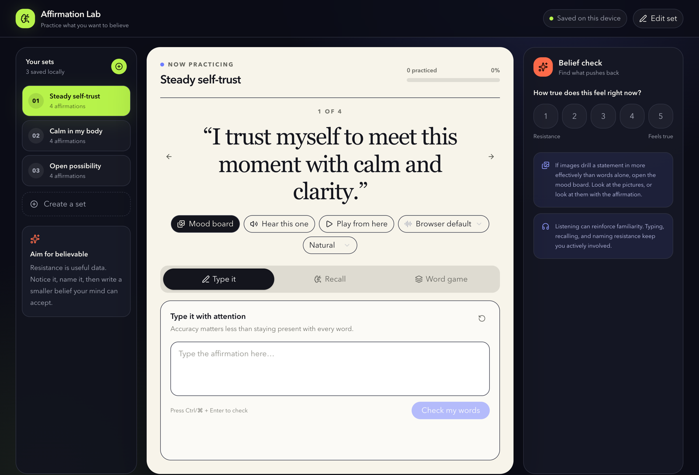
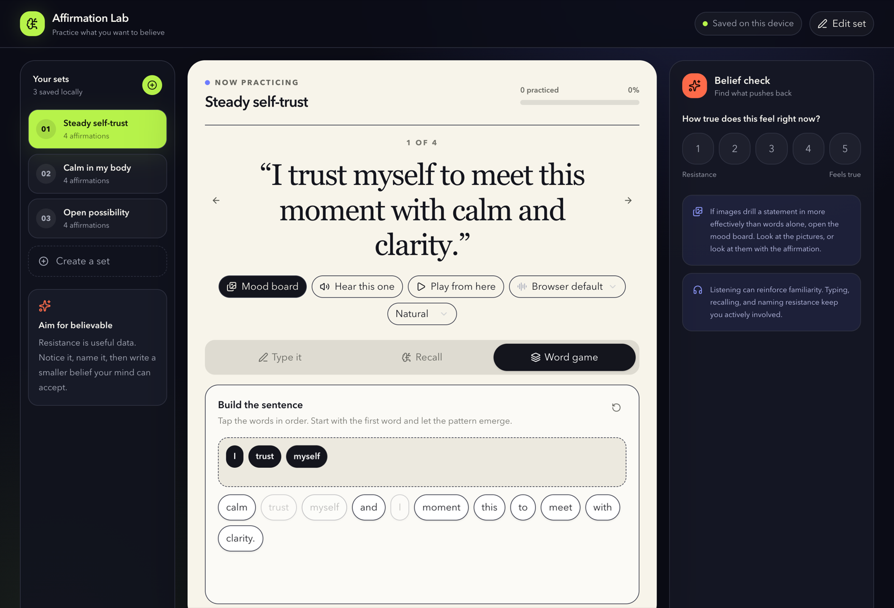
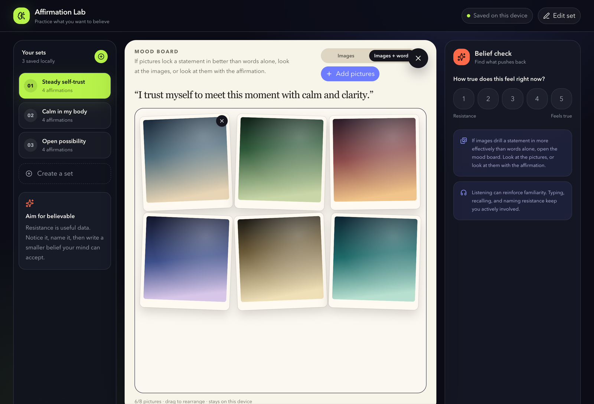

# Affirmation Lab

Practice affirmations by typing, recalling, rebuilding sentences, reflecting, listening with the browser's speech voices, and (optionally) looking at a mood board of pictures.

If images are more effective at drilling in a statement, open the mood board on that line. You can look at the images, or look at the images with the affirmation. Choose a photo, paste one, or drop it onto the board; drag to rearrange; delete what you no longer need. Click a photo to open a preview with photographic memory tools: cycle the picture piece by piece (full, each quadrant, or none), or review it through a circle that follows the pointer (hold to see the whole picture).

Sets, voice choices, and reflections stay in **this browser** (`localStorage`). Mood board photos stay in **this browser** (`IndexedDB`). There is no server database.







## Run locally

```bash
npm install
npm run dev
```

Then open the URL Next.js prints (usually `http://localhost:3000`).

## Scripts

- `npm run dev` — Next.js development server
- `npm run build` — production build; writes a static site to `out/`
- `npm run lint` — ESLint

## Static `out/` folder

`next.config.ts` sets `output: "export"`. After `npm run build`, the site in `out/` uses a host-dependent base path:

- URL contains `localhost` → `/weng/app/sp/affirmations/out/`
- otherwise → `/app/sp/affirmations/out/`

Serve the project so those paths map to `out/` (not `file://`). A repo-root `index.html` redirects to `out/`.

## Deploy (Vercel and similar)

This is a static export. Host the `out/` directory, or import the repo on Vercel with the Next.js preset (`next build`). No Wrangler, D1, or vinext settings are required.
